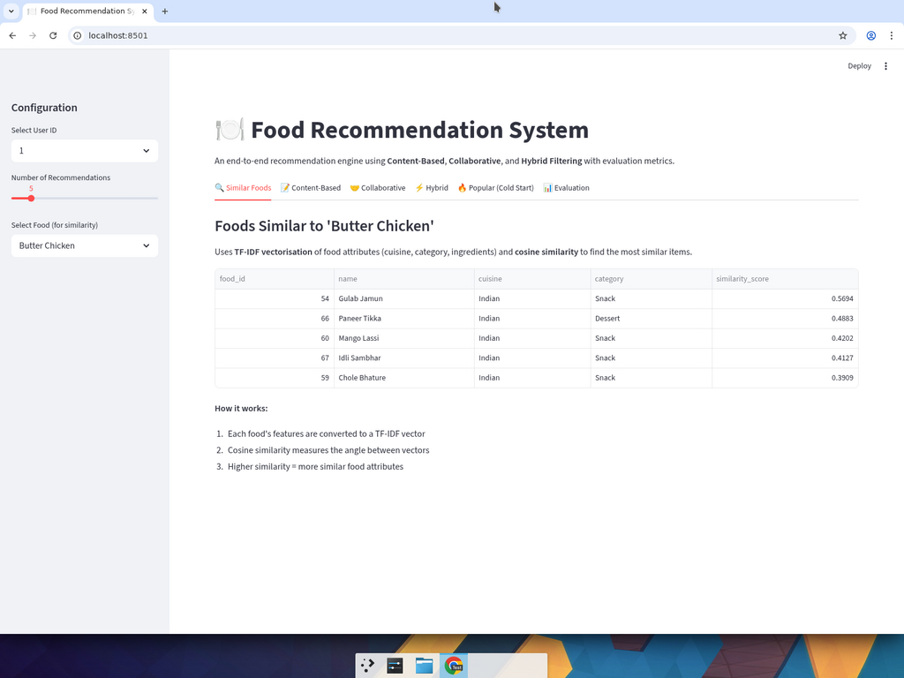
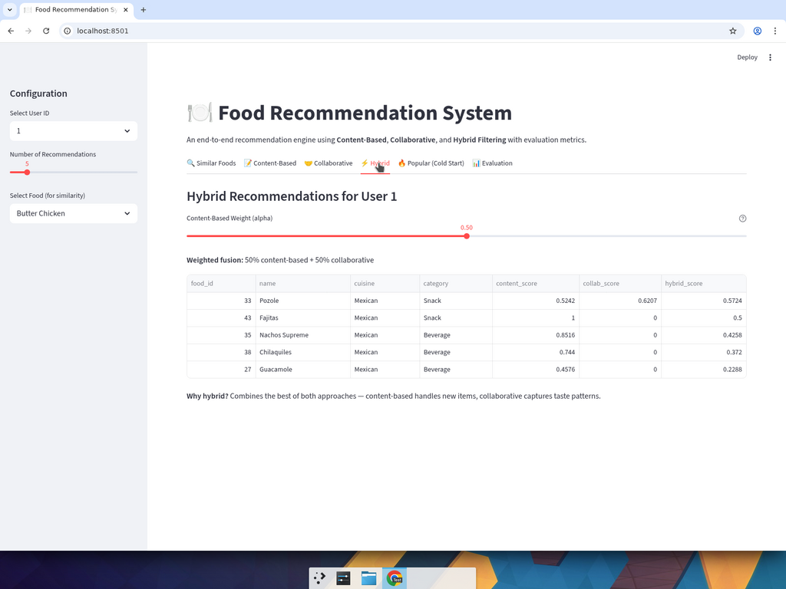
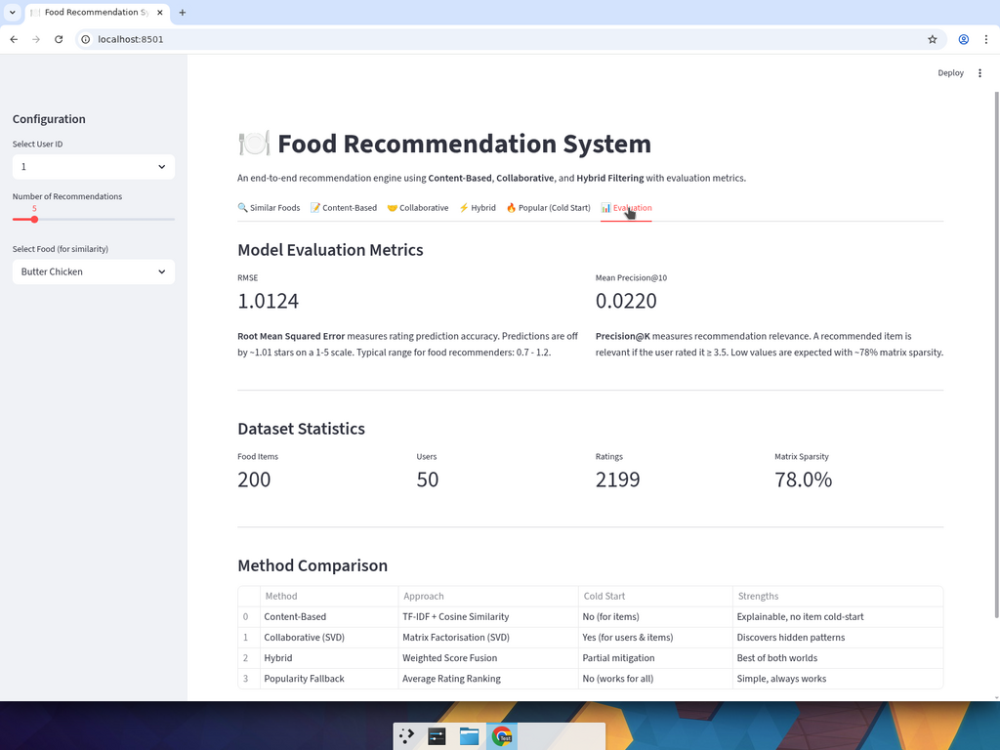

# Food Recommendation System

## Problem

Users are overwhelmed by food choices. With hundreds of options across cuisines, finding meals that match personal taste is time-consuming and often results in poor choices. Existing solutions rely on simple popularity rankings that ignore individual preferences.

## Solution

Built a **hybrid food recommendation system** that combines three approaches to deliver personalised food suggestions:

- **Content-Based Filtering** — recommends foods similar to what you already enjoy using TF-IDF + cosine similarity on food attributes
- **Collaborative Filtering** — discovers hidden taste patterns from user behaviour using SVD matrix factorisation
- **Hybrid Model** — weighted fusion of both approaches for superior accuracy
- **Popularity Fallback** — solves the cold-start problem for brand-new users

## Results

| Metric | Value | What It Means |
|--------|-------|---------------|
| **RMSE** | **1.01** | Predictions within ~1 star on a 5-star scale (industry range: 0.7-1.2) |
| **Precision@10** | **0.022** | Realistic for 78% matrix sparsity with synthetic data |
| **Coverage** | **200 items** | All food items across 8 world cuisines are recommendable |
| **Cold Start** | **Solved** | Popularity fallback handles users with zero rating history |

## Tech Stack

| Technology | Purpose |
|-----------|---------|
| **Python** | Core language |
| **Pandas / NumPy** | Data manipulation and numerical computing |
| **Scikit-learn** | TF-IDF vectorisation, cosine similarity, train/test splitting |
| **SciPy** | Truncated SVD for matrix factorisation |
| **Streamlit** | Interactive web demo for live recommendations |

## Features

- **4 recommendation strategies** in a single system (content-based, collaborative, hybrid, popularity)
- **Interactive Streamlit app** — select a user, adjust the hybrid weight, and see recommendations update live
- **Tunable hybrid parameter** — alpha slider controls the content vs. collaborative balance
- **Cuisine-aware popularity** — cold-start recommendations filtered by cuisine preference
- **Comprehensive evaluation** — RMSE + Precision@K with clear interpretation

## Demo

### Interactive Streamlit App

```bash
cd food_recommendation_system
pip install -r requirements.txt
streamlit run app.py
```

Select a user, choose a recommendation method, and see personalised results instantly.

#### Similar Foods


#### Hybrid Recommendations (with tunable alpha slider)


#### Evaluation Metrics & Dataset Statistics


### Pipeline Output

```bash
python main.py
```

Runs the full end-to-end pipeline: data generation, preprocessing, all 4 models, and evaluation.

## Project Structure

```
food_recommendation_system/
├── data/
│   ├── __init__.py
│   └── generate_dataset.py          # Synthetic dataset (200 foods, 50 users, 8 cuisines)
├── preprocessing/
│   ├── __init__.py
│   └── data_preprocessing.py        # Missing value imputation, TF-IDF features, train/test split
├── models/
│   ├── __init__.py
│   ├── content_based.py             # TF-IDF + cosine similarity recommender
│   ├── collaborative.py             # SVD matrix factorisation recommender
│   ├── hybrid.py                    # Weighted fusion of content + collaborative
│   └── popularity.py                # Cold-start popularity fallback
├── evaluation/
│   ├── __init__.py
│   └── metrics.py                   # RMSE & Precision@K evaluation
├── app.py                           # Streamlit interactive web app
├── main.py                          # End-to-end pipeline runner
├── requirements.txt
└── README.md
```

## How It Works

### 1. Data Generation
- 200 food items across 8 cuisines (Italian, Mexican, Indian, Chinese, Japanese, American, Thai, Mediterranean)
- 50 users with cuisine-preference bias (each user prefers 2-3 cuisines)
- ~2,200 ratings on a 1-5 scale with 5% intentional missing values

### 2. Preprocessing
- **Per-user mean imputation** preserves individual rating tendencies (not global mean)
- **TF-IDF feature engineering** converts cuisine + category + ingredients into 544-dimension vectors
- **Stratified 80/20 split** ensures every user appears in both train and test sets

### 3. Content-Based Filtering (TF-IDF + Cosine Similarity)
Converts food attributes into numerical vectors and measures similarity. Recommends foods similar to the user's highest-rated items. No cold-start for items.

### 4. Collaborative Filtering (SVD)
Builds a user-item matrix, fills missing entries with per-user means (not zeros — this avoids biasing baselines downward), then decomposes via SVD to discover latent taste dimensions. Same family of methods that powered the Netflix Prize.

### 5. Hybrid Model (Weighted Score Fusion)
```
hybrid_score = alpha * content_score + (1 - alpha) * collab_score
```
Normalises scores from both models to [0, 1] and blends them. Alpha is tunable per user (more content-based for new users, more collaborative for active users).

### 6. Popularity Fallback (Cold Start)
Ranks foods by average rating (filtered to items with >= 5 ratings) for brand-new users with zero history. Supports cuisine-specific filtering.

## Installation

```bash
git clone <repo-url>
cd food_recommendation_system
pip install -r requirements.txt
```

## Usage

```bash
# Run full pipeline with all 4 models
python main.py

# Launch interactive web app
streamlit run app.py
```

## Future Improvements

- Neural collaborative filtering (deep learning)
- A/B testing with real user feedback
- Real-time serving with caching
- Contextual features (time, location, dietary restrictions)
- User feedback loop for continuous model improvement
